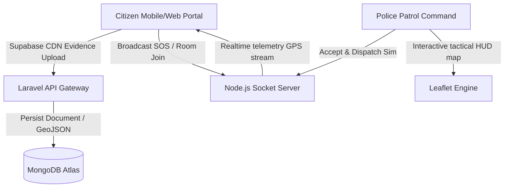

# Smart City Emergency Response Platform: Architecture & Operational Guide

Welcome to the **Smart City Emergency Response & Accident Management Platform**. This guide provides a comprehensive overview of the system architecture, technologies, databases, communication protocols, and previous stability fixes implemented on the platform.

---

## 1. System Architecture Overview

The system is designed as an interactive, event-driven smart city dashboard coordinating emergency reporting, automated dispatcher routing, and live response tracking:



---

## 2. Technology Stack & Directory Structure

### A. Core Technologies
*   **Frontend Client:** React 18, Vite, TailwindCSS (for utility layouts), Leaflet (for geographic information systems), Socket.IO Client.
*   **API Gateway & Backend Logic:** Laravel 11, Laravel Sanctum (token authentication), MongoDB integration client, SMTP Resend Mailer.
*   **Cloud Telemetry & Database:** MongoDB Atlas (retaining GeoJSON spatial coordinates), Supabase Storage (storing raw burst photos and video clips).
*   **Realtime Communication Server:** Node.js + Socket.IO server.

### B. Directory Structure
```
TRAFFIC/
├── traffic-frontend/           # React 18 / Vite Client Web App
│   ├── src/
│   │   ├── components/         # Shared layouts, Protected routes, GIS widgets
│   │   │   └── LiveTracking/   # ETA indicators, Driver detail sheets, Tactical maps
│   │   ├── context/            # AuthContext holding JWT session scopes
│   │   ├── pages/              # Portal specific dash boards
│   │   │   ├── admin/          # Admin metrics, Hospital roster management
│   │   │   ├── auth/           # Login portals (Segregated commands & citizens)
│   │   │   ├── citizen/        # SOS triggers, multi-evidence reports, waiting overlays
│   │   │   ├── police/         # Incident queues, fullscreen maps, dispatch controls
│   │   │   └── responder/      # Active unit GPS routers
│   │   ├── services/           # Axios API connectors, Socket clients, GPS locators
│   │   └── index.css           # Global HSL custom variables & animations
├── traffic-backend/            # Laravel 11 API Server
└── socket-server/              # Realtime Node.js Socket.IO dispatcher (Port 3001)
```

---

## 3. Communication Protocols & Socket Contracts

The Socket server routes telemetry in real-time between responding officers and waiting citizens.

### A. Room Architecture
*   Every active incident has a dedicated tracking room identified by:
    ```
    emergency_{incidentId}
    ```
*   When citizens submit reports or officers activate the response command, they join this room via:
    ```javascript
    socket.emit('register-citizen', { role: 'citizen', emergencyId: incidentId });
    ```

### B. Socket Events Specification
| Event Name | Direction | Payload Structure | Purpose |
| :--- | :--- | :--- | :--- |
| `register-citizen` | Client -> Server | `{ role: string, emergencyId: string }` | Joins the specific incident's live tracking room |
| `gps-update` | Police -> Server | `{ emergencyId: string, lat: number, lng: number, driverId: string }` | Emitted by dispatch command at regular intervals (6000ms) |
| `ambulance-gps` | Server -> Citizen | `{ lat: number, lng: number, heading: number }` | Relays responding unit location coordinates to the citizen dashboard |
| `update-emergency-status` | Police -> Server | `{ emergencyId: string, status: string, lat?: number, lng?: number }` | Updates the status of the emergency incident |
| `emergency-status-updated` | Server -> Citizen | `{ emergencyId: string, status: string }` | Relays the new emergency status to the citizen dashboard |

---

## 4. Database Schema Guidelines (MongoDB GeoJSON)

To allow spatial queries, incident coordinates are stored in the MongoDB Atlas database as **GeoJSON Points**.

### GeoJSON Point Structure
```json
{
  "_id": "60d5ec49f3e1a2b7c4d5f2a1",
  "title": "Severe collision near block 38",
  "reporter_name": "John Doe",
  "reporter_email": "john@smartcitizen.io",
  "location": {
    "type": "Point",
    "coordinates": [75.703131, 31.252243]  // [Longitude, Latitude]
  },
  "images": [
    "https://ovdsvwqqcnngqbylfkeu.supabase.co/storage/v1/object/public/evidence/reports/photo_123.jpg"
  ],
  "status": "Officer En Route"
}
```

> [!WARNING]
> *   **MongoDB GeoJSON format** utilizes `[Longitude, Latitude]` ordering in its `coordinates` array.
> *   **Leaflet Maps Engine** utilizes `[Latitude, Longitude]` or `{ lat, lng }` format for rendering center bounds and markers.
> *   To prevent layout mismatch, always parse coordinates via the `parseMongoLocation` utility function.

---

## 5. Setup & Running Instructions

To start the complete Smart City Emergency Platform locally:

### 1. Start the Laravel Backend
Ensure your PHP and Composer environments are active:
```bash
cd traffic-backend
composer install
php artisan key:generate
php artisan serve
```
*The API gateway will launch on `http://127.0.0.1:8000`.*

### 2. Start the Socket Telemetry Server
Ensure Node.js is installed:
```bash
cd socket-server
npm install
node server.js
```
*The realtime engine will start listening on port `3001`.*

### 3. Start the Frontend Client
```bash
cd traffic-frontend
npm install
npm run dev
```
*Vite will compile and boot your client app on `http://localhost:5173`.*

---

## 6. Stability Fixes & GIS Standardization

During development, the following critical pipelines were standardized to ensure enterprise-grade stability:

1.  **Enforced simulated LPU paths:** Stripped all browser VM `navigator.geolocation` continuous watchers from dispatch simulators to prevent random location jumps.
2.  **Telemetry standard `{ lat, lng }` objects:** Re-aligned Leaflet vector parameters to accept standard `{ lat, lng }` coordinates, preventing longitude/latitude swapping.
3.  **Supabase Storage Fallback Removal:** Disabled local server public-disk fallback storage completely, ensuring all photos and videos are securely written directly to the Supabase Cloud Storage bucket.
4.  **Automatic waiting screen transition:** Configured automated socket listening loops to close the citizen's SOS trigger pane immediately upon officer dispatch, preventing screen locks.
