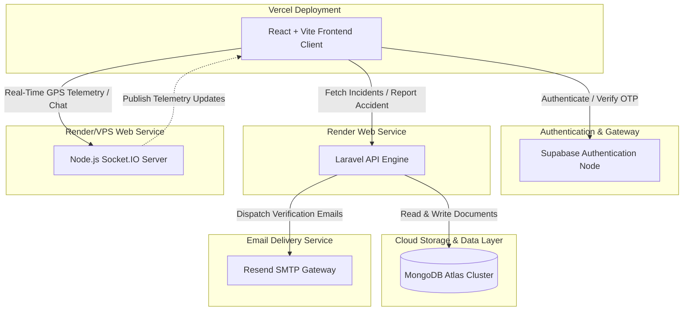

# 🚦 SmartTraffic & Accident Management System

A premium, state-of-the-art intelligent traffic routing, accident response, and real-time telemetry orchestration platform. 

SmartTraffic is built as a highly responsive, modern multi-service ecosystem that coordinates critical accident event tracking, dynamic vehicle dispatch, and citizen safety assistance using **MongoDB Atlas cloud database**, **Supabase authentication**, and a **custom Node.js real-time Socket engine**.

---

## 🏛️ System Architecture



---

## 📁 Repository Structure

*   [**`traffic-frontend`**](file:///c:/Users/pritp/OneDrive/Desktop/TRAFFIC/traffic-frontend): React client-side application built with Vite and Tailwind CSS.
*   [**`traffic-backend`**](file:///c:/Users/pritp/OneDrive/Desktop/TRAFFIC/traffic-backend): Laravel REST API backend, powered exclusively by MongoDB.
*   [**`traffic-socket`**](file:///c:/Users/pritp/OneDrive/Desktop/TRAFFIC/traffic-socket): Node.js WebSocket engine for ambulance/incident GPS telemetry sync.

---

## ⚙️ Environment Configuration Guide

To deploy or run SmartTraffic successfully, configure the following environmental parameters:

### 1. Backend Service Configuration (`traffic-backend/.env`)
Create a production `.env` file in the backend root containing:

```env
APP_NAME=SmartTraffic
APP_ENV=production
APP_KEY=base64:YOUR_GENERATE_APP_KEY
APP_DEBUG=false
APP_URL=https://your-backend.onrender.com

# Exclusive MongoDB Atlas Cloud Connection
MONGODB_URI=mongodb+srv://<username>:<password>@cluster0.dl6d2dz.mongodb.net/smart_traffic_db?appName=Cluster0
MONGODB_DATABASE=smart_traffic_db

# Resend SMTP Configuration
MAIL_MAILER=smtp
MAIL_HOST=smtp.resend.com
MAIL_PORT=465
MAIL_USERNAME=resend
MAIL_PASSWORD=re_yourResendSmtpSecretKey
MAIL_ENCRYPTION=tls
MAIL_FROM_ADDRESS=onboarding@resend.dev
MAIL_FROM_NAME="SmartTraffic Emergency Portal"
```

### 2. Frontend Portal Configuration (`traffic-frontend/.env`)
Create a production `.env` file in the frontend root containing:

```env
VITE_SUPABASE_URL=https://your-project-id.supabase.co
VITE_SUPABASE_ANON_KEY=eyJhbGciOiJIUzI1NiIsInR5cCI6IkpXVCJ9.yourAnonKeyHere

# Dynamic Deployment URL Syncs
VITE_API_BASE_URL=https://your-backend.onrender.com/api
VITE_SOCKET_URL=https://your-socket-server.onrender.com
```

### 3. Socket Engine Configuration (`traffic-socket/.env` or Process Env)
```env
PORT=3001
```

---

## 🛠️ Local Development Quickstart

Ensure you have PHP 8.2+, Composer, Node.js 18+, and local MongoDB running.

1.  **Initialize the Backend**:
    ```bash
    cd traffic-backend
    composer install
    php artisan key:generate
    php artisan db:seed # Populate Atlas with all default users/hospitals
    php artisan serve
    ```
2.  **Initialize the Frontend**:
    ```bash
    cd traffic-frontend
    npm install
    npm run dev
    ```
3.  **Initialize the Real-Time Socket Server**:
    ```bash
    cd traffic-socket
    npm install
    node server.js
    ```

---

## 🚀 Production Deployment Playbook

### Step 1: Deploy Backend (Laravel Engine) to Render
1.  Sign in to [Render](https://render.com) and create a **Web Service**.
2.  Connect your GitHub repository. Set the **Root Directory** to `traffic-backend`.
3.  Configure environment settings:
    *   **Environment**: `PHP`
    *   **Build Command**: `composer install --no-dev --optimize-autoloader`
    *   **Start Command**: `heroku-php-apache2 public/` or Nginx public webroot configuration.
4.  Add all keys listed in **Backend Configuration** above to Render **Environment Variables**.

### Step 2: Deploy Real-Time Socket Server to Render
1.  On Render, create a new **Web Service** for the socket layer.
2.  Connect your GitHub repository. Set the **Root Directory** to `traffic-socket`.
3.  Configure:
    *   **Environment**: `Node`
    *   **Build Command**: `npm install`
    *   **Start Command**: `node server.js`
4.  Copy the generated deployment URL of this service (e.g., `https://smarttraffic-socket.onrender.com`).

### Step 3: Deploy Frontend (React Portal) to Vercel
1.  Sign in to [Vercel](https://vercel.com) and click **Add New Project**.
2.  Select your GitHub repository.
3.  Configure deployment parameters:
    *   **Framework Preset**: `Vite`
    *   **Root Directory**: `traffic-frontend`
    *   **Build Command**: `npm run build`
    *   **Output Directory**: `dist`
4.  Under **Environment Variables**, add:
    *   `VITE_SUPABASE_URL`
    *   `VITE_SUPABASE_ANON_KEY`
    *   `VITE_API_BASE_URL` (Points to Render backend URL + `/api`)
    *   `VITE_SOCKET_URL` (Points to Render socket server URL)
5.  Click **Deploy**!

---

## 🔒 Security Audit & Public Upload Verification
Before pushing to GitHub:
*   [**Root `.gitignore`**](file:///c:/Users/pritp/OneDrive/Desktop/TRAFFIC/.gitignore) is actively monitoring your root folder to ensure zero local configs, credentials, or binaries can bypass and leak to your GitHub remote.
*   **Vite environment boundaries** are verified; only variables prefixed with `VITE_` are exposed, preserving backend database and SMTP integrity.
